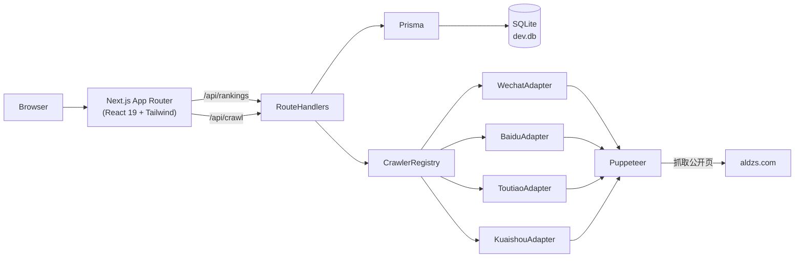

# weapp 多端小程序排行榜

## 范围界定（MVP 严格收敛，遵循 KISS / YAGNI）

- **本期交付**：4 端排行榜抓取 + 列表查询 + 详情抽屉 + 手动触发抓取
- **不在本期**：
  - 联系方式/工商信息抓取（Contact 表仅建 schema，接口不实现）
  - 历史趋势图、AB 对比、导出 Excel
  - 用户登录、权限、多租户
  - 定时任务调度（先做手动 POST 触发，二期再接 cron）
- **合规说明**：仅抓取阿拉丁等公开榜单页面，User-Agent 公开声明、限速、缓存本地；不做任何个人信息二次爬取

## 目标架构



## 核心目录结构（最小集）

```
weapp/
├── prisma/schema.prisma
├── src/
│   ├── app/
│   │   ├── layout.tsx
│   │   ├── page.tsx                     排行榜主页
│   │   ├── globals.css
│   │   └── api/
│   │       ├── rankings/route.ts        GET 列表（带分页/搜索/平台过滤）
│   │       ├── miniapps/[id]/route.ts   GET 详情
│   │       └── crawl/route.ts           POST 手动触发抓取
│   ├── components/
│   │   ├── PlatformTabs.tsx
│   │   ├── RankingTable.tsx
│   │   ├── SearchBar.tsx
│   │   ├── MiniAppDrawer.tsx
│   │   ├── CrawlButton.tsx
│   │   └── ui/*                         shadcn 风格基础组件
│   ├── lib/
│   │   ├── db.ts                        Prisma singleton
│   │   ├── puppeteer.ts                 浏览器工厂 + 限速
│   │   └── crawlers/
│   │       ├── types.ts                 CrawlerAdapter 接口（DIP）
│   │       ├── registry.ts              平台 → Adapter 映射
│   │       ├── wechat.ts
│   │       ├── baidu.ts
│   │       ├── toutiao.ts
│   │       └── kuaishou.ts
│   └── types/platform.ts
├── package.json
├── tsconfig.json
├── tailwind.config.ts
├── next.config.ts
├── .env.example
└── .gitignore
```

## 数据模型（Prisma）

核心三张表 + 一张预留联系方式表（本期不写入）：

- `MiniApp(id, platform, externalId, name, logoUrl, category, subjectName, description)` 唯一键 `(platform, externalId)`
- `Ranking(id, miniAppId, platform, rank, score, snapshotAt)` 唯一键 `(platform, snapshotAt, rank)`
- `Contact(id, miniAppId, phone, email, website, source)` **仅建表不写入**
- `CrawlJob(id, platform, status, startedAt, finishedAt, totalCount, error)` 抓取任务记录

## 爬虫适配器（SOLID: DIP + OCP）

```ts
export interface RankingItem {
  externalId: string;
  name: string;
  logoUrl?: string;
  category?: string;
  subjectName?: string;
  rank: number;
  score?: number;
}

export interface CrawlerAdapter {
  platform: Platform;
  fetchRanking(limit: number): Promise<RankingItem[]>;
}
```

- 四端分别实现 `CrawlerAdapter`，新增平台只需添加一个文件并注册进 `registry.ts`，不触碰调度层
- `fetchRanking` 内部：打开阿拉丁对应榜单页 → 滚动/翻页到 1000 名 → 解析 DOM → 返回归一化结构
- `puppeteer.ts` 提供单例浏览器、随机 UA、请求间隔 1–2s、失败自动重试 2 次

### 落地风险与优先级

- 微信榜最成熟（阿拉丁核心业务），**P0**
- 百度/头条/快手榜可能需翻页交互或登录态，**P1**：若公开页不足 1000 名，先取能拿到的上限，在 `CrawlJob.totalCount` 如实记录，前端显示真实数量
- 全部适配器失败时，任务状态写 `failed`，不污染历史数据

## API 合约

- `GET /api/rankings?platform=WECHAT&q=拼多多&page=1&pageSize=50`
  - 返回 `{ total, items: [{ rank, name, logo, category, subjectName, score, snapshotAt }] }`
  - 默认返回最新 `snapshotAt` 的数据
- `GET /api/miniapps/:id` 返回 MiniApp 全字段 + 最近 30 天排名轨迹（本期只返回最新一条）
- `POST /api/crawl` body `{ platform: 'WECHAT'|'BAIDU'|'TOUTIAO'|'KUAISHOU'|'ALL', limit?: number }`
  - 异步启动，立即返回 `{ jobId }`
  - 前端轮询 `GET /api/crawl?jobId=` 取状态（同一个 route.ts 处理 GET/POST）

## 前端交互（极简主义 B 端风格）

按 UIUX 建议采用 **Minimalism**（企业 Dashboard 首选）：

- 主色中性灰 + 功能色（四端 Tab 用品牌色徽标：微信绿 / 百度蓝 / 抖音黑红 / 快手橙）
- 圆角 8px、阴影仅卡片浅投影、悬停过渡 200ms
- 关键组件：
  - `PlatformTabs`：顶部 4 端切换，URL 带 `?platform=`
  - `SearchBar`：防抖 300ms，匹配 name / subjectName
  - `RankingTable`：分页每页 50 行（共 20 页到 1000），字段：排名 / LOGO+名称 / 主体 / 分类 / 指数 / 操作
  - `MiniAppDrawer`：右侧抽屉，展示基础信息 + 联系方式区块显示「暂未开放，二期上线」占位
  - `CrawlButton`：右上角下拉，触发单端或全量抓取，吐司显示任务状态

## 依赖清单（固定最小集）

- 运行：`next@^15`, `react@^19`, `react-dom@^19`, `typescript`, `@prisma/client`, `prisma`, `puppeteer`, `zod`
- UI：`tailwindcss`, `@radix-ui/react-dialog`, `@radix-ui/react-tabs`, `lucide-react`, `clsx`, `tailwind-merge`
- 不引入：状态管理库（本期用 URL + RSC）、UI 组件库全家桶、图表库

## 交付方式

按 user rule：**不编译、不运行、不写测试脚本、不生成总结型 MD**。我只负责写源码与 `package.json`/`schema.prisma`/`.env.example` 等必要配置，安装依赖、`prisma migrate`、`dev` 启动由你本地执行。
