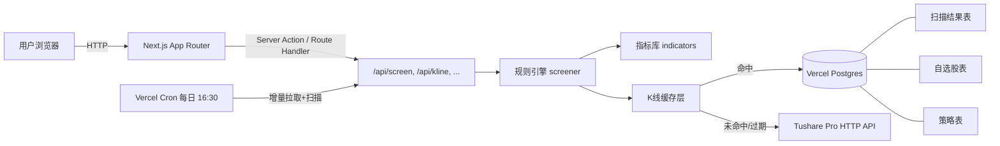

# 右侧交易高胜率指标体系（Next.js 全栈版）

## 1. 设计哲学校准（KISS / YAGNI / SOLID）

- **KISS**：单仓 Next.js 全栈，不引入额外微服务；数据库只存「股票元信息 / 日 K 缓存 / 扫描结果 / 自选 / 策略」5 张表。
- **YAGNI**：MVP 只做日线级；不做 Tick/分时；不做账户体系（单用户即可，先用环境变量护栏）；不做实盘下单。
- **SOLID**：分层清晰——`data/`（仅 IO）、`indicators/`（纯函数）、`screener/`（规则引擎）、`backtest/`（策略评估）、`app/`（UI + API），各层只依赖下层接口而非实现，方便日后替换 Tushare 为其它 Provider。

## 2. 架构总览



## 3. 技术栈

- **框架**：Next.js 14 App Router + TypeScript + React Server Components
- **样式**：Tailwind CSS + shadcn/ui
- **图表**：lightweight-charts（TradingView 同源，K 线性能最佳）
- **数据**：Tushare Pro HTTP API（`http://api.tushare.pro` 单一 endpoint）
- **存储**：Vercel Postgres（或 Neon 免费层） + Prisma ORM
- **数据请求**：TanStack Query（前端缓存）+ 服务端 fetch + revalidateTag
- **校验**：Zod（API 入参 / 规则 DSL 校验）
- **定时**：Vercel Cron Jobs（`vercel.json`）

## 4. 目录结构

```
stock-screener-web/
├── app/
│   ├── (dashboard)/
│   │   ├── layout.tsx
│   │   ├── page.tsx                    # 首页：今日命中
│   │   ├── screen/page.tsx             # 筛选条件 + 实时扫描
│   │   ├── stock/[tsCode]/page.tsx     # 单股 K线 + 指标 + 命中详情
│   │   ├── backtest/page.tsx           # 历史回测
│   │   ├── watchlist/page.tsx          # 自选股
│   │   └── history/page.tsx            # 历史扫描记录
│   ├── api/
│   │   ├── stocks/route.ts             # 股票池查询（行业/市值过滤）
│   │   ├── kline/[tsCode]/route.ts     # 单股 K线（缓存层）
│   │   ├── screen/route.ts             # 触发筛选
│   │   ├── backtest/route.ts           # 触发回测
│   │   ├── watchlist/route.ts          # 自选股 CRUD
│   │   ├── strategy/route.ts           # 策略 CRUD
│   │   └── cron/daily-scan/route.ts    # Vercel Cron 入口
├── lib/
│   ├── data/
│   │   ├── tushare.ts                  # Tushare HTTP 客户端 + 限速
│   │   ├── kline-cache.ts              # 优先查 DB，缺失回源
│   │   └── universe.ts                 # 股票池构建
│   ├── indicators/                     # 纯函数
│   │   ├── ma.ts (sma/ema)
│   │   ├── macd.ts
│   │   ├── kdj.ts rsi.ts boll.ts atr.ts
│   │   ├── volume.ts (量比/缩量回踩)
│   │   └── breakout.ts (N日新高/平台突破)
│   ├── screener/
│   │   ├── rule-engine.ts              # JSON 规则求值器
│   │   ├── presets.ts                  # 内置策略
│   │   └── scoring.ts
│   ├── backtest/
│   │   └── runner.ts                   # 简化回测：买入持有 N 日
│   └── db/prisma.ts
├── prisma/schema.prisma
├── components/
│   ├── kline-chart.tsx
│   ├── rule-builder.tsx
│   ├── result-table.tsx
│   ├── stock-search.tsx
│   └── ...
├── vercel.json                         # Cron 配置
├── .env.example                        # TUSHARE_TOKEN, DATABASE_URL
└── README.md
```

## 5. 核心数据模型（Prisma 节选）

- `Stock(tsCode PK, symbol, name, industry, market, listDate)`
- `KlineDaily(tsCode, tradeDate, ohlc, vol, amount)`，复合主键 `(tsCode, tradeDate)`
- `Strategy(id, name, ruleConfig Json)` —— 规则 DSL
- `ScanRun(id, strategyId, scanDate, hitCount)`
- `ScanResult(id, scanRunId, tsCode, score, detail Json)`
- `Watchlist(id, tsCode, note)`

## 6. 高胜率指标体系（在现有三共振基础上扩展）

- **趋势**：MA 多头 5/10/20/60、MA20 斜率向上（已有）；MA60 非下行（新增）
- **动量**：MACD 0 轴上金叉（已有）；RSI(14) ∈ [50,80] 强势但未超买（新增）；KDJ 9/3/3 金叉（新增）
- **量价**：量比 ≥ 1.5（已有）；缩量回踩 MA20（量 ≤ 5 日均 × 0.8，新增）
- **突破**：20 日新高（已有）；平台突破（前 20 日收盘振幅 < 8% 后放量，新增）
- **风控**：ATR(14)/价 ∈ [1%, 6%]，剔除妖股/僵尸股（新增）

迁移现有 `stock-screener-ext/src/indicators.js` 的 `sma/ema/macd/volumeRatio/rollingHigh` 到 TS，新增 `kdj/rsi/boll/atr/platformBreakout`。规则评估器以 JSON DSL 表示，三共振预设示例：

```ts
{
  name: "三指标共振",
  conditions: [
    { type: "ma_bull",        periods: [5,10,20,60] },
    { type: "ma_slope_up",    period: 20, lookback: 3 },
    { type: "macd_above_zero" },
    { type: "macd_golden",    window: 3 },
    { type: "vol_ratio_gte",  ratio: 1.5, base: 5 },
    { type: "break_n_high",   period: 20 }
  ],
  logic: "AND"
}
```

## 7. Tushare 调用策略（关键约束）

- 单一接口入口 `lib/data/tushare.ts`，封装 `pro_bar`（前复权 K 线）、`stock_basic`、`daily_basic`、`trade_cal`。
- **限速**：用 `p-limit` 控制并发 ≤ 5；429/积分不足时指数退避。
- **缓存优先**：`getKline(tsCode, n)` 先查 `KlineDaily` 表，缺失/最后日期 < 最近交易日才回源。
- **Cron 增量**：每个交易日 16:30 跑 `/api/cron/daily-scan`，先按交易日历增量补 K 线，再跑全 A 股扫描，结果写入 `ScanRun` / `ScanResult`。
- **README 显式说明**：Tushare 注册、token、最低积分门槛（pro_bar 需 2000 积分），并提供「内置精选池」作为低积分备选。

## 8. 关键页面交互

- **筛选页**：左栏选股票池（内置精选 / 全 A 股 / 行业 / 自选）+ 勾选规则 + 调阈值；右栏命中表格（评分排序，导出 CSV，点击进单股详情）。
- **单股详情**：K 线主图 + MA 叠加 + MACD/RSI/KDJ 副图，命中日高亮，右侧条件清单按 ✓/✗ 列出。
- **回测页**：选策略 + 选区间 + 选股票池 → 输出胜率、平均持仓收益、最大回撤、收益曲线、明细列表。
- **历史/自选**：列表 + 简单查询。

## 9. 部署配置

- 环境变量（`.env.example`）：`TUSHARE_TOKEN`、`DATABASE_URL`、`CRON_SECRET`。
- `vercel.json`：

```json
{
  "crons": [{ "path": "/api/cron/daily-scan", "schedule": "30 8 * * 1-5" }]
}
```

（北京时间 16:30 = UTC 08:30，避开收盘瞬间拥堵）

- README 包含：本地启动、Tushare 申请、Vercel Postgres 配置、Cron 测试方法、免责声明。

## 10. 风险与缓解

- **Tushare 积分门槛**：默认接口对新账号有限制；README 显式说明，并在 UI 上对「全 A 股扫描」加二次确认；提供「内置精选池」作为低积分备选。
- **数据准确性**：所有数据为前复权日线，UI 明确标注；不做盘中实时。
- **合规**：每页底部固定免责声明「本工具仅供学习研究，不构成投资建议」（沿用现有 popup.html 措辞）。

## 11. 与现有 stock-screener-ext 的关系

- 不删除原 Chrome 扩展；新项目放在仓库根目录新文件夹 `stock-screener-web/`，独立 `package.json`。
- 指标算法直接迁移：`stock-screener-ext/src/indicators.js` → `stock-screener-web/lib/indicators/*.ts`，逻辑零改动，仅加类型。
- 三共振规则迁移：`stock-screener-ext/src/screener.js` 的 `evaluate` → `lib/screener/presets.ts` 中 `bullThreeResonance` 预设，并通过通用规则引擎统一表达。

## 12. 实施分期（建议节奏）

- **第 1 期（MVP，可上线）**：项目骨架 + Tushare 接入 + 指标库 + 规则引擎 + 三共振预设 + 筛选页 + 单股 K 线页。
- **第 2 期**：历史回测 + 更多预设策略 + 平台突破。
- **第 3 期**：Vercel Cron 每日扫描 + 历史扫描页 + 自选股。

下方 todos 即按此分期切分，便于逐步推进。
